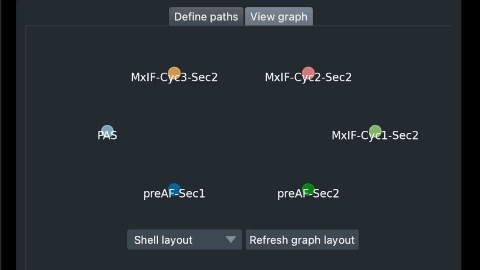

# napari-wsireg

[//]: # ([![License]&#40;https://img.shields.io/pypi/l/napari-wsireg.svg?color=green&#41;]&#40;https://github.com/nhpatterson/napari-wsireg/raw/main/LICENSE&#41;)

[//]: # ([![PyPI]&#40;https://img.shields.io/pypi/v/napari-wsireg.svg?color=green&#41;]&#40;https://pypi.org/project/napari-wsireg&#41;)

[//]: # ([![Python Version]&#40;https://img.shields.io/pypi/pyversions/napari-wsireg.svg?color=green&#41;]&#40;https://python.org&#41;)

[//]: # ([![tests]&#40;https://github.com/nhpatterson/napari-wsireg/workflows/tests/badge.svg&#41;]&#40;https://github.com/nhpatterson/napari-wsireg/actions&#41;)

[//]: # ([![napari hub]&#40;https://img.shields.io/endpoint?url=https://api.napari-hub.org/shields/napari-wsireg&#41;]&#40;https://napari-hub.org/plugins/napari-wsireg&#41;)

Plugin to perform whole slide image registration based on wsireg.

Please see [wsireg](https://github.com/nhpatterson/wsireg) for more info image formats, features and how registration works.

## Usage

Add images from napari layers or from file and set up "registration paths" between them. OME-TIFF is best supported format.

### Constructed registration graph in action

_Solid arrows_: direct registration between two images.

_Dashed arrows_: indriect registration paths.

## Installation

You can install `napari-wsireg` via [pip]:

    pip install napari-wsireg

To install latest development version :

    pip install git+https://github.com/nhpatterson/napari-wsireg.git

## Contributing

Contributions are very welcome. Tests can be run with [tox], please ensure
the coverage at least stays the same before you submit a pull request.

## License

Distributed under the terms of the [BSD-3] license,
"napari-wsireg" is free and open source software

## Issues

If you encounter any problems, please [file an issue] along with a detailed description.

[napari]: https://github.com/napari/napari
[Cookiecutter]: https://github.com/audreyr/cookiecutter
[@napari]: https://github.com/napari
[MIT]: http://opensource.org/licenses/MIT
[BSD-3]: http://opensource.org/licenses/BSD-3-Clause
[GNU GPL v3.0]: http://www.gnu.org/licenses/gpl-3.0.txt
[GNU LGPL v3.0]: http://www.gnu.org/licenses/lgpl-3.0.txt
[Apache Software License 2.0]: http://www.apache.org/licenses/LICENSE-2.0
[Mozilla Public License 2.0]: https://www.mozilla.org/media/MPL/2.0/index.txt
[cookiecutter-napari-plugin]: https://github.com/napari/cookiecutter-napari-plugin

[file an issue]: https://github.com/nhpatterson/napari-wsireg/issues

[napari]: https://github.com/napari/napari
[tox]: https://tox.readthedocs.io/en/latest/
[pip]: https://pypi.org/project/pip/
[PyPI]: https://pypi.org/
